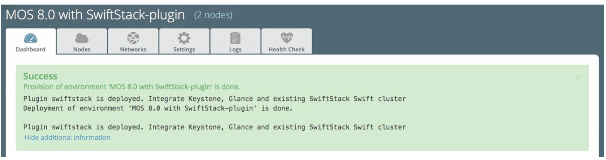

User Guide
==========

SwiftStack provides **On-Premises** and **Public(Platform)** Controller to manage Swift clusters. Here is a overview for network topology between SwiftStack Controller and Fuel environment. And these are minimum deployments. Please make sure the network configuration is able to:

    .. note::

        We only use one PACO (Proxy/Account/Comtainer/Object) nodes to deploy a simple Swift cluster in this document.
        In real environment, you might setup ten nodes or more for a Swift cluster, so follow roles in below can help you do integration.

    1. Fuel Controller nodes (Keystone, Glance) can talk to Swift Proxy (i.e., Proxy-only, PAC, PACO node) for :ref:`Outward-facing IP<proxy_outward_facing_ip>`.
    2. Clients can talk to :ref:`Swift API IP Address<swift_api_ip>` (Swift Proxy or Load balancer)
    3. SwiftStack nodes can talk to SwiftStack Controller

Use SwiftStack On-Premises Controller
-------------------------------------

    * 1 Controller Node (have **Controller** and **Storage - Cinder** roles)
    * 1 Compute Node
    * 1 Swift cluster
    * 1 SwiftStack On-Premises controller

    .. image:: images/use_on_prem.png

Use SwiftStack Public Controller (Platform)
-------------------------------------------

    * 1 Controller Node (have **Controller** and **Storage - Cinder** roles)
    * 1 Compute Node
    * 1 Swift cluster

    .. image:: images/use_platform.png

Deploying Mirantis OpenStack with a SwiftStack Swift cluster
------------------------------------------------------------

#. Create a new environment with two nodes:

    * Select **Liberty on Ubuntu Trusty (14.04)** as the distribution
    * Select **Neutron with VLAN segmentation** as the networking setup
    * Use all default settings
    * 1 Controller Node (has **Controller** and **Storage - Cinder** roles)
    * 1 Compute Node (has **Compute** role)

    .. image:: images/1_add_nodes.png

    .. _swift_api_ip_address:

#. Go to the Settings tab of the Fuel Web UI,
   scroll down to **Storage** section, select **Enable SwiftStack Swift Cluster Integration** checkbox
   and fill up all parameters Swift API IP Address: ``192.168.1.100``.

    .. note::
        If **Enable upload test** is disabled, Fuel won't upload testVM image(cirros-testvm)
        to Glance and store in Swift cluster. That means some **Functional tests** won't pass:
        ``Create volume and boot instance from it``.

    .. note::
        If **Use Swift as Glance backend** is disabled,
       please consider to enable  **Ceph RBD for images (Glance)** or other storage for Glance backend.

    .. image:: images/2_enable_plugin.png

#. Go to the **Networks** tab, scroll down to **Storage** section and then
   uncheck **Use VLAN tagging** and modify **IP Range** to skip the Swift Proxy IP
   (Outwarding-facing) and Swift API IP Address.

    .. image:: images/3_config_network.png

    .. _proxy_outward_facing_ip:
    .. _swift_api_ip:

    .. note::
        If you have more than one Proxy server (Proxy-only, PAC, PACO nodes),
        or you use external/internal load balancer (Swift API IP Address) for
        your swift cluster, please consider to skip these IPs.

        * ``Outtward-facing IP from SwiftStack Controller UI``

        .. image:: images/3-1_proxy_outwarding-facing.png

        * ``Swift API IP address(Load balancer IP) from SwiftStack Controller UI``

        .. image:: images/3-2_swift_api_ip.png

#. Go to the **Nodes** tab of the Fuel Web UI,
   drag **Storage** interface to **eth2** for all nodes:

    .. image:: images/4_config_interfaces.png

   .. _find_keystone_password:

#. Find the settings from deployment information:
    * Keystone IP Address (management_vip)
    * Swift password
    * Glance password (for testing)

    .. code-block:: bash

        # Log into the Fuel Master node:

        [root@fuel ~]$ fuel env --list

        id | status | name    | release_id | pending_release_id
        ---|--------|---------|------------|-------------------
        5  | new    | MOS 8.0 | 2          | None

        [root@fuel ~]$ fuel deployment --env 5 --default
        Default deployment info was downloaded to /root/deployment_5

        # Keystone IP
        [root@fuel ~]$ sed -e '/vips:/,/ipaddr:/!d' deployment_*/primary-controller*.\
        yaml
          vips:
              management:
                    ipaddr: 192.168.0.2

        # Swift user
        [root@fuel ~]$ sed -e '/swift:/,/user_password:/!d' deployment_*/\
        primary-controller*.yaml
          swift:
            user_password: Ym35Y7j43K6LgsY9xYkJ5TbW

        # Glance user
        [root@fuel ~]$ sed -e '/glance:/,/user_password:/!d' deployment_*/primary-controller*.\
        yaml 
           glance:
             db_password: XkyxjTF4LKu7FgaY2YyXlUMI
               image_cache_max_size: '13928339865'
                 user_password: ZHFGFM7ivEi0XPuL7l4tt5jE

   .. _setup_swift_middleware:

#. Once we get Keystone IP (192.168.0.2) and Swift user’s password (``Ym35Y7j43K6LgsY9xYkJ5TbW``), \
   let’s login to SwiftStack Controller UI to configure Swift cluster
    
    * Go to the **Middleware** tab, enable and configure **Keystone Auth Token Support** middleware as below:

        .. code-block:: bash

            identity_url: http://192.168.0.2:35357/
            auth_url: http://192.168.0.2:5000/
            admin_user: swift
            admin_password: Ym35Y7j43K6LgsY9xYkJ5TbW
            admin_tenant_name: services

        .. image:: images/5_config_key1.png

    * Enable and configure **Keystone Auth** middleware as below:

        .. code-block:: bash

            reseller_admin_role: admin

        .. image:: images/6_config_key2.png

#. Push configure settings to SwiftStack Swift cluster.

#. Get back to the Fuel Web UI and deploy your OpenStack environment.

#. Once Mirantis OpenStack environment is done, you will see the SwiftStack plugin is also deployed.

Verification
++++++++++++

Please run the verification steps below to ensure your Swiftstack plugin is configured properly:

* Check API endpoints from OpenStack Dashboard:

  .. image:: images/8_deploy_verify2.png

  
.. _verity_cluster_swift_cli:

* Verify Swift cluster, Keystone and Glance integration through Swift cli

  .. code-block:: bash

    # Login to one of nodes of Swift cluster. 

    # Test admin account
    ~$ cat rc.admin 
    export ST_AUTH=http://192.168.0.2:5000/v2.0
    export ST_USER=admin:admin
    export ST_KEY=admin
    export ST_AUTH_VERSION=2

    ~$ source rc.admin 
    ~$ swift stat -v
                                 StorageURL: http://192.168.1.100:80/v1/KEY_c59857e..
   .... 9f07a44e691e1a12d3ef71d59
                                 Auth Token: gAAAAABW77vTlydZxpTB0yiRimVlTorg6IC9GR..
   .... lB5moChyd-P6NlsQ_rJva114IecQxxHB4YR5cdRECCY4VQZnDSP9wgneG-xSi6P4XKwLDmX9lQK..
   .... bYGpCb1l19JyiuBdRZyoc3JC0uiFtW6YfQ0mvPpVOEWgQJ02tL-vBqfFNcuiiWthn20Rok
                                    Account: KEY_c59857e9f07a44e691e1a12d3ef71d59
                                 Containers: 0
                                    Objects: 0
                                      Bytes: 0
    Containers in policy "standard-replica": 0
       Objects in policy "standard-replica": 0
         Bytes in policy "standard-replica": 0
                              Accept-Ranges: bytes
                X-Account-Project-Domain-Id: default
                                X-Timestamp: 1458550300.21393
                                 X-Trans-Id: tx1d579f93ee7846fab0eaa-0056efbbd3
                               Content-Type: text/plain; charset=utf-8

    # Test glance account
    ~$ cat rc.glance 
    export ST_AUTH=http://192.168.0.2:5000/v2.0
    export ST_USER=services:glance
    export ST_KEY=ZHFGFM7ivEi0XPuL7l4tt5jE
    export ST_AUTH_VERSION=2

    ~$ swift stat -v
                              StorageURL: http://192.168.1.100:80/v1/KEY_fc5bc05137..
    .... 09448da632c525728cf79
                              Auth Token: gAAAAABW77t5VpWr7tzqAtOhYhWiQOo11kqeoSS_0s..
    ... mnX1WgNprVkAl5Sj8Ut0DuHYnBcg7UdwH00OHfotqS9PmetqQSP-RTuQwmwVLH8JAHtp.....
    ... ZLm5CFa0ocIJjo35oFavevzrjsokY4MefxyNlIhByshPelV6Dp3RD0C9aBygH96gedpOEUw
                                    Account: KEY_fc5bc0513709448da632c525728cf794
                                 Containers: 1
                                    Objects: 1
                                      Bytes: 13287936
    Containers in policy "standard-replica": 1
       Objects in policy "standard-replica": 1
         Bytes in policy "standard-replica": 13287936
                              Accept-Ranges: bytes
                X-Account-Project-Domain-Id: default
                                X-Timestamp: 1458547227.84808
                                 X-Trans-Id: txac14e38486ea45c98bc6d-0056efbb8d
                               Content-Type: text/plain; charset=utf-8

Appendix
--------

    * SwiftStack docs can be found at https://swiftstack.com/docs/

